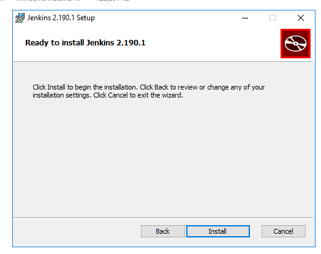
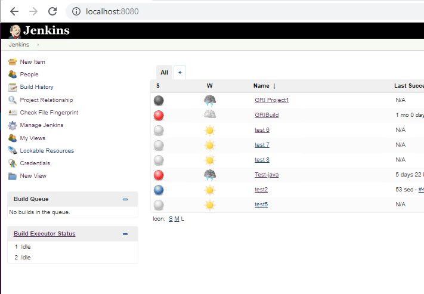
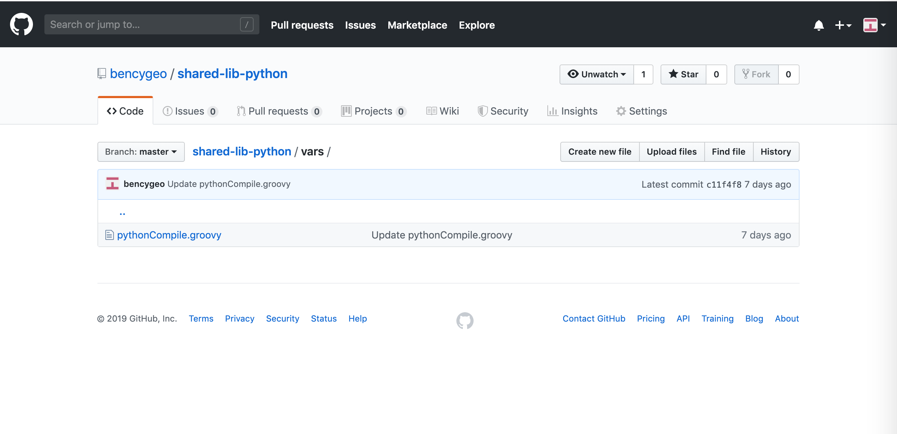

### Install and Configure JENKINS  on your machine.

Download and Install Jenkins :
Pre- requisite : Java version 8 or higher must be installed
1. Click on the following link 
   (https://jenkins.io/download/)
    and Download Jenkins 2.19.0 for Windows
    

    unzip jenkins-2.190.1.zip

2. Run the installer
   

3. Choose the destination folder for Jenkins

4. Click Install
   

5.  Click Finish
    

6.  Open JENKINs admin console.
    http://localhost:8080/

7. Unlock Jenkins    
   If you chose a different destination folder in step no 3 then you will have the initial Admin Password in that location under secrets folder.
   Copy the password from the location shown below.
   

   Give the password and click on continue.
    
8.  In Customize Jenkins page select Install suggested plugins.      One may install other plugins later. However if one knows        which plugins  they require may select “Select plugins to        install”.
    

 9. Wait until the plugins are completely installed
    

 10. Create first Admin User   
     

  11. Click “Save and Finish” to complete the Jenkins                installation.

  12. Now, click “Start using Jenkins” to start Jenkins.
      

  13. Here is default Jenkins Page
      
    
  14. To create pipeline. Click New Item.  
      
      
  15. Enter name, select pipeline. Click ok at the bottom of the     page.
      

  16. Give Description. In Advanced project options
      Definition : Pipeline from SCM
      SCM : Git
      Script path : Jenkinsfile
      Click Save.
      

     Note : Jenkins file needs to created in git.
     Sample Jenkins file :
     pipeline {
	 agent any
	 stages {
	 stage('Build from local') {
	    steps {
	      script {
	     bat 'C:\\jenkins\\samplebatch.bat'
	        }
	      }
	     }
       }
      }

   17. Click on Build now 
     
    
   18. Click on console output to view the output
      
    
    
   

##### Jenkins Shared Libraries

 Pipeline has support for creating "Shared Libraries" which can be defined in external source control repositories and loaded into existing Pipelines.
A Shared Library is defined with a name, a source code retrieval method such as by SCM, and optionally a default version.

- The official documentation for [Jenkins Shared Libraries](https://jenkins.io/doc/book/pipeline/shared-libraries/) can find here.

###### Global Shared Libraries
- Shared Libraries marked Load implicitly allows Pipelines to immediately use classes or global variables defined by any such libraries.

###### How to Configure

- Go to `Manage Jenkins` » `Configure System` » `Global Pipeline Libraries` as many libraries as necessary can be configured.

###### Configure below details.
- `Library name` the name which need to refer globally in Jenkins files.
- `Default version` Git repo branch details.
- select `Modern SCM` and select `Git` option to configure the Git URL where the shared library files are added.

- `save` it. 

##### Git repo details of shared library.

- This is the Git repo created for adding shared library files, the same has confugured in Jenkins server.
The shared library files should be under `vars` directory.

- You can refer this repo :[here](https://github.com/bencygeo/shared-lib-python) 

- This is a sample `groovy` script created to demo basic way to write methods and use it in pipelines.
##### How to use shared library in pipeline.

- create a new pipeline in Jenkin server.
- Go to Jenkin server
- click on `New Item`

- enter `pipeline` name
- select `pipeline` option
- click on `ok`

- go to `Pipeline` and add required pipeline script.

- click `Save` and `Apply`

- This sample pipeline calls two methods from `global shared library`

Pipeline script for refernce.

- Source repo can find [here](https://github.com/bencygeo/Test_Jenkin)

##### Run the Pipeline.

- Go to the newly created pipeline and click on `Build Now` option.

- you can see the `stages` are successfully completed.

- Check the `console output` from the build to see the log's